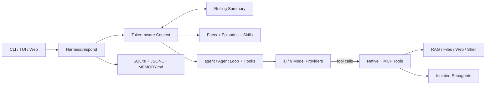

# LSM 的个人 Harness

一个中文优先、本地保存状态、可以完整读懂与调试的个人 Agent Harness。

v2.2 在原有 Token-aware Context、滚动摘要、三类长期记忆与 Trace 闭环上，加入了
项目文件工具、受控 Shell、Web、RAG、MCP、隔离子 Agent、多模型、Thinking、Hooks、
图片输入和流式 TUI。所有能力仍通过同一个可检查的 Agent Loop 运行。

完整源码导读见 [《核心 Harness 指南》](docs/core-harness-guide.md)。
Pi 学习改造见 [《Pi 第三章 Agent Loop 对照》](docs/pi-chapter-3-mapping.md) 和
[《Pi 第四章模型调用对照》](docs/pi-chapter-4-mapping.md)，工具系统见
[《Pi 第五章工具系统对照》](docs/pi-chapter-5-mapping.md)。

## 核心链路



## 快速开始

需要 Python 3.11 或更高版本。

```bash
cd /Users/lsm/Desktop/lsm-harness
python3.13 -m venv .venv
source .venv/bin/activate
pip install -e '.[dev]'
cp .env.example .env
```

需要向量 RAG 或 MCP 时安装对应扩展：

```bash
pip install -e '.[dev,rag,mcp]'
```

在 `.env` 中填写所选 Provider 的 API Key，然后：

```bash
lsm doctor     # 本地环境检查，不调用模型
lsm smoke      # 确定性核心测试，不需要 API Key
lsm            # Rich CLI
lsm tui        # Textual TUI
lsm web        # Waku 风格全流程 Web 控制台，默认 127.0.0.1:8910
lsm serve      # `lsm web` 的兼容别名
pytest         # 自动化测试
```

## 终端能力

- `/memory`：查看 facts 与 episodes。
- `/sessions`、`/resume <id>`、`/new`：管理本地会话。
- `/summary`：查看当前滚动摘要。
- `/usage`：查看 token 用量。
- `/model`：列出并热切换 Provider 与模型。
- `/tree`：查看当前会话结构。
- `Shift+Tab`：循环切换 Thinking（off/auto/on）。
- `@文件名`：模糊引用项目文件；图片文件会作为多模态输入发送。
- Agent 工作中按 `Enter`：加入 steering 队列，在当前 Turn 后紧急插队。
- Agent 工作中按 `Alt+Enter`：加入 followUp 队列，等当前任务自然停下后继续。
- `Ctrl+C`：中止当前 Trace。

核心代码遵循 `coding_agent → agent → ai` 单向依赖：产品层用 `ToolDefinition`
绑定 Session、CLI 和 Operations；Agent 层用 `AgentTool` 负责 Loop、五步工具管道与
批次调度；AI 层只接收纯描述型 `Tool` 并负责 Provider 转换。

## 记忆与上下文

- **Working Memory**：按 Token 预算动态保留最近原始对话。
- **Rolling Summary**：达到阈值后增量压缩较早对话，最近若干轮保持原文。
- **Session Persistence**：SQLite 与 JSONL 支持重启恢复、导入导出和版本化摘要。
- **Semantic Memory**：长期事实；**Episodic Memory**：发生过的事情。
- **Procedural Memory**：`SOUL.md` 与本地 `SKILL.md`。
- **Context Governance**：工具结果按大小保留、截断或落盘，避免切断工具调用链。

状态位于 `.lsm/`：

```text
.lsm/
├── state.db
├── SOUL.md
├── MEMORY.md
├── calendar.ics
├── sessions/
├── skills/
├── tool-results/
├── outbox/
└── traces/
```

## 模型、工具与安全边界

- 支持 DeepSeek、OpenAI、Anthropic、Gemini、OpenRouter、xAI、Kimi、GLM、MiniMax。
- 主模型负责回答和工具决策，小模型负责检索门、记忆提炼、上下文压缩和 RAG 重排。
- 原生工具覆盖日历、记忆、项目文件、Shell、Web、RAG 与子 Agent；MCP 工具动态发现。
- 工具执行固定经过 prepare、JSON Schema、approval/before、execute、after/result，
  所有阶段错误都作为 `is_error` 结果返回模型。
- 只读工具可并行执行；任意串行工具会让整批串行，结果始终按模型调用顺序返回。
- 文件读写和宿主机 Shell 被限制在项目目录。
- 启用 Docker Sandbox 后，如果 Docker 不可用，Shell 会安全失败，不会降级到宿主机。
- 子 Agent 使用独立 Harness、Session、ToolRegistry 和 SQLite 连接，默认只获得只读工具。
- Web 仅监听 `127.0.0.1`，每次启动生成随机 Token，并校验 Host、Origin、CSP 与请求体大小。
- Web 中 `local_write`、`external_write` 工具逐次确认；宿主机 Shell 默认不注册。

RAG 默认关闭。安装 `.[rag]` 并设置 `LSM_RAG_ENABLED=true` 后启用本地 BGE 向量、
SQLite FTS5、RRF 与小模型重排。MCP 使用 `.lsm/mcp_servers.toml` 配置，并需要 `.[mcp]`。

## Web 全流程控制台

`lsm web` 使用 Waku 式三栏界面展示完整 LSM 拓扑。Overview 的节点和边来自服务端
唯一的 `FLOW_SPEC`，由 CLI、TUI、Web 共用的 Trace 事件实时点亮，并可选择历史 Trace
进行暂停、单步和 1×/2× 重放。右侧 Chat Dock 支持流式回复、审批、Stop、Steer 与会话管理；
Memory、RAG、Tools、Subagents、Files、Database、Ops、Settings 提供对应只读状态页。

第一版边界是本机单用户 Beta，不提供公网、多用户、任意 SQL 或网页编辑 API Key。
当前仍不包含 Graph Workflow 与 LLM-as-Judge。

## 验证

离线回归套件覆盖核心 Loop、记忆、上下文、工具与 Trace，以及 v2.2 的 Shell、FileState、
RAG 索引同步、Hooks、模型切换、子 Agent 隔离、Web Token/CSP/Origin、审批协议、统一事件和
多模态持久化。`tests/test_real_api.py` 是显式的联网集成测试。

## 来源与许可

该项目的教学思路和三类记忆结构受到
[ShenSeanChen/waku-agent](https://github.com/ShenSeanChen/waku-agent) 启发；核心接口、
中文检索、DeepSeek 适配、事件协议和项目结构在本项目中重新实现。详见 `NOTICE.md`。
