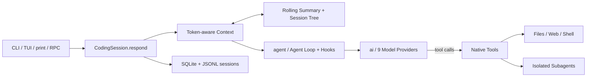

# LSM 的个人 Harness

一个中文优先、本地保存状态、可以完整读懂与调试的个人 Agent Harness。

v3.0 与 Pi 同构：严格的三层架构 `ai → agent → coding_agent`，四种前端
（CLI / TUI / print / RPC）共用同一个可检查的 Agent Loop。相比 v2.2 删掉了
Web 控制台、长期记忆、RAG、MCP、个人助理工具与全部历史兼容层——代码量更小，
每层职责单一。

当前核心边界见 [《Pi 核心对齐状态》](docs/pi-core-alignment.md)；
[《核心 Harness 指南》](docs/core-harness-guide.md) 保留为 v2.2 历史功能说明。
Pi 学习改造见 [《Pi 第三章 Agent Loop 对照》](docs/pi-chapter-3-mapping.md) 和
[《Pi 第四章模型调用对照》](docs/pi-chapter-4-mapping.md)，工具系统见
[《Pi 第五章工具系统对照》](docs/pi-chapter-5-mapping.md)。

## 核心链路



## 快速开始

需要 Python 3.11 或更高版本。

```bash
cd /Users/lsm/Desktop/lsm-harness
python3.13 -m venv .venv
source .venv/bin/activate
pip install -e '.[dev]'
cp .env.example .env
```

在 `.env` 中填写所选 Provider 的 API Key，然后：

```bash
lsm doctor          # 本地环境检查，不调用模型
lsm smoke           # 确定性核心测试，不需要 API Key
lsm                 # Rich CLI
lsm tui             # Textual TUI
lsm -p "列出当前目录"   # print 模式：一次性问答，回复上 stdout，工具活动上 stderr
lsm rpc             # RPC 模式：stdin/stdout 上的 JSONL 命令协议，供编辑器集成
pytest              # 自动化测试
```

## 终端能力

- `/sessions`、`/resume <id>`、`/new`：管理本地会话。
- `/summary`：查看当前滚动摘要。
- `/usage`：查看 token 用量。
- `/model`：列出并热切换 Provider 与模型。
- `/tree`：查看当前会话结构。
- `Shift+Tab`：循环切换 Thinking（off/auto/on）。
- `@文件名`：模糊引用项目文件；图片文件会作为多模态输入发送。
- Agent 工作中按 `Enter`：加入 steering 队列，在当前 Turn 后紧急插队。
- Agent 工作中按 `Alt+Enter`：加入 followUp 队列，等当前任务自然停下后继续。
- `Ctrl+C`：中止当前 Trace。

核心代码遵循 `coding_agent → agent → ai` 单向依赖：产品层用 `ToolDefinition`
绑定 Session、CLI 和 Operations；Agent 层用 `AgentTool` 负责 Loop、五步工具管道与
批次调度；AI 层只接收纯描述型 `Tool` 并负责 Provider 转换。

## 上下文与会话

- **Working Memory**：按 Token 预算动态保留最近原始对话。
- **Rolling Summary**：达到阈值后增量压缩较早对话，最近若干轮保持原文。
- **Session Tree**：JSONL append-only 会话树（认父不认子），是权威会话记录，
  支持分支、回退与分支摘要；SQLite 只存 chat_log 检索/记忆投影与兼容摘要。
- **Context Governance**：工具结果按大小保留、截断或落盘，避免切断工具调用链。
- **Skills**：`.lsm/skills/` 下的 `SKILL.md` 以懒加载清单进系统提示，
  模型按需 `read_file` 读取。

状态位于 `.lsm/`：

```text
.lsm/
├── state.db
├── sessions/
├── skills/
├── tool-results/
└── traces/
```

## RPC 模式

`lsm rpc` 在 stdin/stdout 上说一行一条的 JSONL 协议，事件词汇与 CLI/TUI/Tracer
完全一致：

```bash
printf '%s\n' '{"id":"1","type":"get_state"}' \
  '{"id":"2","type":"prompt","message":"hi"}' | lsm rpc
```

- 命令：`prompt`（含 `streamingBehavior: steer/followUp`）、`abort`、
  `get_state`、`set_model`、`set/cycle_thinking_level`、`new_session`、
  `switch_session`、`get_messages`、`get_available_models`、`compact`。
- 应答：`{"id":…,"type":"response","command":…,"success":bool,…}`；
  运行事件：`{"type":"event","event":{…}}`。
- 单条 record 上限 16 MiB；stdin EOF 时中止当前运行并干净退出。

## 模型、工具与安全边界

- 支持 DeepSeek、OpenAI、Anthropic、Gemini、OpenRouter、xAI、Kimi、GLM、MiniMax。
- 主模型负责回答和工具决策，小模型负责上下文压缩与分支摘要。
- 原生工具覆盖项目文件、Shell、Web 搜索与子 Agent。
- 工具执行固定经过 prepare、JSON Schema、approval/before、execute、after/result，
  所有阶段错误都作为 `is_error` 结果返回模型。
- 只读工具可并行执行；任意串行工具会让整批串行，结果始终按模型调用顺序返回。
- 文件工具（read/write/edit 等）把路径解析限制在项目目录内，越界读写会被拒绝。
- Shell 仅宿主机模式（Pi 式）：命令以当前进程权限运行，cwd 限定项目目录。
  注意：cwd 检查只限制进程的启动目录，不能阻止命令通过绝对路径访问其他位置，
  不构成文件系统隔离。
- allow/deny 策略按命令名限制可执行范围，但通用解释器（如 `python -c`）可以
  绕过按名称的限制——它是减负护栏，不是安全边界。
- 子 Agent 使用独立 CodingSession、Session、ToolRegistry 和 SQLite 连接，默认只获得只读工具。

## 验证

离线回归套件覆盖核心 Loop、上下文压缩、会话树、工具管道、Trace、Hooks、
模型切换、子 Agent 隔离、多模态持久化，以及 print/RPC 两个机器入口。
`tests/test_real_api.py` 是显式的联网集成测试（默认跳过）。
GitHub Actions 在 push 和 pull request 上运行同一套离线测试；`lsm eval`
使用与断言独立的脚本模型 fixture，并会和最近一次 golden 记录进行真实比较。

## 来源与许可

该项目的教学思路受到
[ShenSeanChen/waku-agent](https://github.com/ShenSeanChen/waku-agent) 启发；
核心接口、DeepSeek 适配、事件协议和项目结构在本项目中重新实现。详见 `NOTICE.md`。
