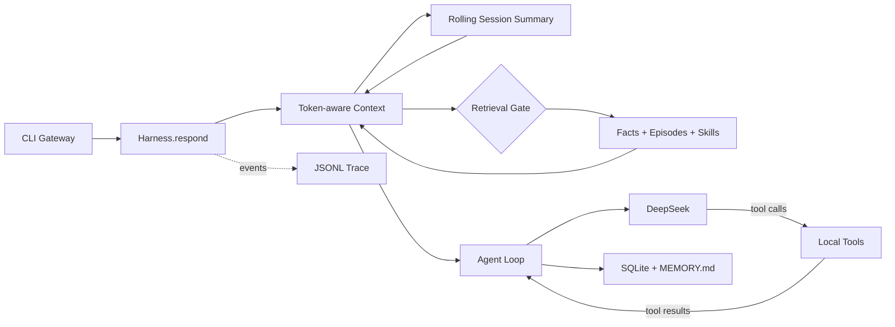

# LSM 的个人 Harness

一个中文优先、本地保存状态、可以完整读懂与调试的个人 Agent Harness。

完整的功能、请求链路、记忆机制与源码导读见
[《LSM 的个人 Harness：功能与架构说明》](docs/core-harness-guide.md)。

v1.1 已将真实 DeepSeek、Token-aware Context、滚动摘要、Agent Loop、本地工具、三类
长期记忆和 Trace 连成一个可重复验证的闭环。没有 Web 框架、Graph、MCP 或外部写操作
遮挡核心机制。

## 核心链路



## 快速开始

需要 Python 3.11 或更高版本；本项目开发时使用 Python 3.13。

```bash
cd /Users/lsm/Desktop/lsm-harness
python3.13 -m venv .venv
source .venv/bin/activate
pip install -e '.[dev]'
cp .env.example .env
```

在 `.env` 中填写你自己的 `DEEPSEEK_API_KEY`，然后：

```bash
lsm doctor     # 本地环境检查，不调用模型
lsm smoke      # 确定性核心测试，不需要 API Key
lsm            # 进入真实 DeepSeek 对话
pytest         # 运行完整自动化测试
```

CLI 内置命令：

- `/memory`：查看 facts 与 episodes。
- `/sessions`：查看本地会话及摘要版本。
- `/resume <id>`：用完整 ID 或唯一前缀恢复会话。
- `/summary`：查看当前滚动摘要。
- `/new`：开启新会话。
- `/quit`：退出；长期记忆继续保存在本地。

## 第一轮真实验收

依次尝试：

1. `记住：我正在开发 LSM Harness。`
2. 退出并重新运行 `lsm`。
3. `我现在正在开发什么项目？`
4. `帮我创建明天上午十点的 Harness 复盘，持续一小时。`
5. 输入 `/memory`，然后查看 `.lsm/traces/<日期>.jsonl`。

你应当看到 `save_note`、Retrieval Gate 的 `retrieve`、`create_event`，以及完整的
`turn.started → llm.completed → tool.completed → turn.completed` 事件链。

## 记忆设计

- **Working Memory**：按 Token 预算动态保留最近原始对话。
- **Rolling Summary**：达到阈值后用 Flash 增量压缩较早对话，最近 6 轮保持原文。
- **Session Persistence**：`sessions` 与 `session_summaries` 支持重启恢复和版本化摘要。
- **Semantic Memory**：`facts` 表，保存长期事实。
- **Episodic Memory**：`episodes` 表，保存发生过的事情。
- **Procedural Memory**：`SOUL.md` 与本地 `SKILL.md`。
- **Consolidation**：默认每 6 次完整对话，用 Flash 将原始 `chat_log` 提炼为 facts 和 episode。
- **RAG**：Flash 先判断是否检索；中文使用 SQLite FTS5 trigram，短词使用参数化 `LIKE` 回退。

数据库与可读文件都位于 `.lsm/`：

```text
.lsm/
├── state.db
├── SOUL.md
├── MEMORY.md
├── calendar.ics
├── skills/
└── traces/
```

## 模型与工具边界

- `deepseek-v4-pro`：主回答和工具决策。
- `deepseek-v4-flash`：Retrieval Gate、Consolidation 与 Context Compression。
- 第一阶段关闭 Thinking Mode，确保 JSON Gate 和多轮工具调用稳定。
- 工具策略只允许 `read` 与 `local_write`；没有真实日历、消息发送、Shell 或网络工具。

## 当前范围

v1.1 不包含 Web Dashboard、Graph Workflow、MCP、子 Agent、向量数据库、外部写操作和
LLM-as-Judge。这些能力会在核心闭环稳定后分阶段增加。

## 来源与许可

该项目的教学思路和三类记忆结构受到
[ShenSeanChen/waku-agent](https://github.com/ShenSeanChen/waku-agent) 启发；核心接口、
中文检索、DeepSeek 适配、事件协议和项目结构在本项目中重新实现。详见 `NOTICE.md`。
