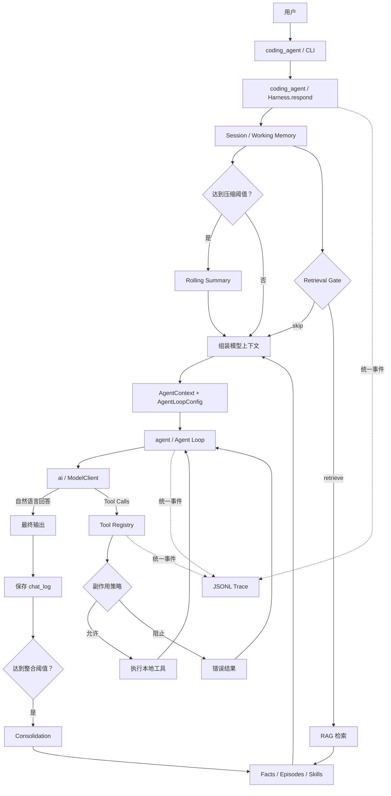

# LSM 的个人 Harness：功能与架构说明

> 文档版本：v2.2
> 项目定位：中文优先、状态本地保存、核心链路可读可调试的个人 Agent Harness

> 注意：这是删减重构前的历史功能说明，其中 Web、长期记忆、RAG、MCP 和
> Docker 沙箱等内容不代表当前 v3.0。当前实现以
> [《Pi 核心对齐状态》](pi-core-alignment.md) 和 README 为准。

## 1. 这个项目是什么

LSM Harness 不是一个简单的“模型聊天窗口”，而是一套包在大语言模型外面的 Agent 运行系统。

大语言模型负责理解问题、生成回答和决定是否调用工具；Harness 负责给模型准备上下文、管理记忆、执行工具、限制副作用、保存数据并记录整个运行过程。

可以把两者的关系理解为：

- **模型是大脑**：负责推理与决策，当前可在多个 Provider 间切换。
- **Harness 是身体和运行环境**：负责记忆、行动、状态、边界和可观测性。
- **CLI Gateway 是入口**：负责接收用户输入、展示过程与输出。

v1.1 首先跑通了下面这条最小但真实的闭环；v2.2 在此基础上加入文件与 Shell 工具、Web、MCP、子 Agent、文档 RAG、上下文治理、文件回滚、Docker 沙箱、Hooks、流式终端和模型热切换：

```text
用户输入
  → 上下文与记忆组装
  → 模型决策
  → 本地工具执行
  → 工具结果返回模型
  → 最终回答
  → 对话与长期记忆落盘
  → 全过程写入 Trace
```

这个项目的重点不是功能数量，而是证明你理解一个 Agent Harness 最核心的内部机制，并且能够自己实现、调试和解释这些机制。

## 2. 当前完成了哪些能力

| 能力 | 当前实现 | 作用 |
| --- | --- | --- |
| Gateway | 流式 CLI、Textual TUI、本机 Web 控制台 | 接收输入并实时展示回答、工具调用和状态 |
| 模型接入 | 9 个 Provider + 运行时热切换 | 使用统一接口完成回答和工具决策 |
| Agent Loop | `reason → act → observe` 多轮循环 | 让模型能够连续调用工具，而不只生成一次文本 |
| Working Memory | Token 预算内的最近原始对话 | 维持当前对话的短期连贯性 |
| Rolling Summary | Flash 生成的版本化会话摘要 | 在长对话中保留目标、决定、结果和待办 |
| Session Persistence | SQLite `sessions`、`session_summaries` | 重启后恢复会话及压缩状态 |
| Semantic Memory | SQLite `facts` | 保存用户、项目、偏好等长期事实 |
| Episodic Memory | SQLite `episodes` | 保存一段时间内发生过的事情 |
| Procedural Memory | `SOUL.md` 与 `SKILL.md` | 定义 Agent 的行为原则和做事方法 |
| 原始对话 | SQLite `chat_log` | 为上下文恢复和记忆整合保留原始材料 |
| RAG | Gate + FTS5 trigram + LIKE + 中文相关性排序 | 按需从长期记忆中找回相关内容 |
| Consolidation | 每 6 次完整对话自动触发 | 将原始对话提炼成 facts 和 episode |
| 本地工具 | 日历、笔记、记忆、Soul、Skill | 让 Agent 能够执行可验证的本地动作 |
| 副作用策略 | 只允许 `read` 和 `local_write` | 防止第一阶段误操作外部系统 |
| Trace | 统一事件结构写入 JSONL | 复盘每轮模型调用、工具调用和异常 |
| 自检 | `doctor` 与 `smoke` | 分别检查环境和验证核心链路 |
| 文档 RAG | 文件分块、Embedding、FTS5、RRF 与 rerank | 按需检索项目文档；默认关闭，作为可选依赖安装 |
| 子 Agent | 后台与同步执行、独立 Session、工具白名单 | 并行处理受限子任务，不污染主会话运行状态 |
| MCP | stdio Client、工具发现与 Schema 规范化 | 将 MCP Server 工具接入统一 Tool Registry |
| 文件状态 | 写前快照、diff、单文件或全部撤销 | 跟踪 Agent 文件修改并支持回滚 |
| 沙箱 | Docker 隔离与失败关闭 | 启用沙箱时不允许静默降级到宿主机执行 Shell |

## 3. 整体架构



项目按职责拆分，而不是把所有逻辑写在一个聊天函数里：

```text
src/lsm_harness/
├── ai/               # Provider 中立消息类型、ModelClient、Provider 适配
├── agent/            # AgentContext、AgentLoopConfig、Loop、双队列、通用工具协议
├── coding_agent/     # Harness、Session、CLI、Subagent 产品组合层
├── memory/           # 检索、存储、整合、Skills
├── tools/            # Coding Agent 的具体工具实现
├── gateway/          # TUI / Web 与旧 CLI 兼容入口
├── loop/             # 旧 Agent Loop 兼容入口及上下文治理
├── ops/              # Trace
├── app.py            # coding_agent.app 的兼容入口
├── models.py         # ai.providers 的兼容入口
├── runtime.py        # coding_agent.session 的兼容入口
├── config.py         # 配置读取
└── db.py             # SQLite Schema 与连接
```

依赖方向被固定为 `coding_agent → agent → ai`。`ai` 不知道 Agent 或产品，
`agent` 不知道记忆、RAG、CLI 和具体文件工具；只有 `coding_agent` 负责把这些能力组装起来。
架构边界由 `tests/test_architecture.py` 自动检查。

## 4. 一次请求具体发生了什么

假设用户输入：

```text
我现在正在开发什么项目？
```

系统会依次完成以下工作。

### 4.1 Gateway 接收输入

CLI 只负责入口和展示，它不会直接把字符串裸传给 DeepSeek。它调用公共入口：

```python
Harness.respond(user_message)
```

这样以后即使增加 Web、桌面端或 API Gateway，它们也能复用同一个 Harness Core。

### 4.2 创建 Trace

一次 `Harness.respond()` 是一个完整的 **Trace**。系统为它生成唯一的 `trace_id`，首先记录 `trace.started`。当前 HTTP 路由仍保留 `turn_id` 作为兼容字段，但它和 `trace_id` 指向同一个 Trace，不代表循环里的单个 Turn。

Trace 内部，每次“主模型调用 + 该次调用触发的全部工具执行”构成一个 **Turn**。因此，模型先调用工具、拿到结果后再回答的请求，会形成一个 Trace 和两个 Turn。

### 4.3 构造上下文

Session 会组合：

1. `SOUL.md` 中的行为与人格设定；
2. 匹配到的本地 Skills；
3. 当前会话的滚动摘要；
4. Token 预算内的最近原始对话；
5. Retrieval Gate 找回的长期记忆；
6. 当前用户消息。

这一步是 Harness 的重要价值：模型的效果不仅取决于模型本身，也取决于给它什么上下文、按照什么顺序给、哪些内容应该省略。

### 4.4 Retrieval Gate 判断是否需要记忆

`deepseek-v4-flash` 先判断当前问题属于：

- `skip`：不需要长期记忆，例如普通数学题；
- `retrieve`：涉及用户、项目、偏好或过去事件，需要检索。

Gate 的目的，是减少无意义检索产生的噪声。如果 Gate 调用失败，系统会 **fail-open**，默认执行检索，以免因为辅助模型异常而漏掉重要记忆。

### 4.5 Agent Loop 驱动主模型

组装完成后，`deepseek-v4-pro` 进入 Agent Loop。

```text
调用模型
  ├─ 没有 Tool Call → 返回最终回答
  └─ 有 Tool Call
       → 校验工具与参数
       → 执行工具
       → 把工具结果作为 tool message 返回模型
       → 再次调用模型
```

循环最多执行 10 次。达到上限后会强制退出，防止模型陷入无限工具调用。

工具报错不会直接让进程崩溃。错误会以工具结果的形式返回模型，让模型有机会修正参数、选择其他工具，或者向用户解释失败原因。

产品层不是把十几个参数零散传入循环，而是先建立 `AgentContext`（system、messages、tools）
与 `AgentLoopConfig`（model、工具前后钩子、工具执行模式、队列回调、Turn 钩子和运行策略），再调用通用
`run_agent_loop()`。这是与 Pi 三层设计对齐的主要边界。

完整的学习对照见 [《Pi 第三章 Agent Loop 对照》](pi-chapter-3-mapping.md)、
[《Pi 第四章模型调用对照》](pi-chapter-4-mapping.md) 和
[《Pi 第五章工具系统对照》](pi-chapter-5-mapping.md)。

### 4.6 StopReason 与 Trace 结果

模型适配器先把不同 Provider 的结束原因归一化，Agent Loop 只处理五种
`StopReason`：

| StopReason | Loop 行为 | Trace 结果 |
| --- | --- | --- |
| `tool_calls` | 执行工具，并在未终止时进入下一个 Turn | 继续运行；工具主动终止时为 `completed` |
| `stop` | 没有工具调用，正常结束 | `completed` |
| `length` | 拒绝可能截断的工具参数并尝试压缩上下文 | 恢复成功则继续；不可恢复或超过上限则 `failed` |
| `error` | 模型调用失败，立即硬停止 | `failed` |
| `aborted` | 用户中断，立即硬停止 | `aborted` |

`TraceResult` 同时返回 `status`、`stop_reason` 和 `error`。Provider 异常会被转换为
结构化失败，而不是直接打断默认 CLI。失败或中断的请求不会写入正常 `chat_log`，也不会
触发长期记忆整合，避免把不完整结果当成成功对话。

### 4.7 保存对话并尝试整合

只有 Trace 正常完成后，用户消息和助手回答才会写入 `chat_log`。当累计达到默认的 6 次完整对话时，Consolidation 会尝试把尚未整合的原始对话提炼为长期记忆。

最后，系统导出可读的 `MEMORY.md`，并记录 `trace.completed`。

## 5. 中立模型接口为什么重要

主 Agent Loop 没有直接依赖某一家模型 SDK 的具体返回结构，而是依赖中立流接口：

```python
StreamFunction(Model, AIContext, StreamOptions)
    -> Iterator[AssistantMessageEvent]
```

十二种 `AssistantMessageEvent` 统一描述正文、thinking 和工具调用的 start、delta、
end，以及整个响应的 start、done、error。每个事件携带当前 `ModelResponse` 快照，
其中统一包含：

- 文本回答；
- `ToolCall[]`；
- 停止原因；
- Token 用量。

OpenAI-compatible 与 Anthropic Messages 各自由独立翻译器转换请求和响应；翻译器
通过 `Model.api` 在注册表中选择。旧 `ModelClient.complete()` / `stream_complete()`
保留为 Memory、RAG 和现有集成的兼容门面，不再是主 Loop 的架构边界。

这意味着：

- 当前可以使用 DeepSeek、OpenAI、Anthropic、Gemini、OpenRouter、xAI、Kimi、GLM 和 MiniMax；
- 测试时可以替换为脚本化模型，不产生 API 费用；
- 后续仍可增加本地模型适配器；
- Agent Loop 不需要因模型供应商变化而重写。

默认 DeepSeek 配置的模型分工如下，其他 Provider 使用各自的主模型和轻量模型：

| 模型 | 职责 | 原因 |
| --- | --- | --- |
| `deepseek-v4-pro` | 主回答、工具选择、多轮 Agent Loop | 负责核心理解与决策 |
| `deepseek-v4-flash` | Retrieval Gate、Consolidation、Context Compression | 任务较小，强调速度与成本 |

Thinking 使用 `off` 到 `xhigh` 的统一能力档位，并由模型元数据映射为
`reasoning_effort`、DeepSeek 开关或 Anthropic thinking budget。产品层仍支持
`disabled`、`auto`、`enabled` 三种便捷模式。

## 6. 记忆系统

这个项目不只是“三个记忆文件”，而是不同生命周期、不同职责的几类状态。

### 6.1 Working Memory：当前会话记忆

Working Memory 不再固定截取 12 轮，而是估算 System Prompt、工具 Schema、历史消息和
当前问题的 Token 总量，在 `LSM_CONTEXT_BUDGET_TOKENS` 预算内动态保留最近原始对话。

它解决的是“刚才说过什么”，特点是：

- 容量由 Token 预算控制；
- 与当前会话强相关；
- `/new` 会开启新的 Working Memory 会话；
- `/sessions` 与 `/resume <id>` 可以查看和恢复历史会话；
- 超过压缩阈值后，较早对话进入 Rolling Summary，最近若干轮继续保留原文。

默认上下文设置为：

| 环境变量 | 默认值 | 作用 |
| --- | ---: | --- |
| `LSM_CONTEXT_BUDGET_TOKENS` | 24000 | 主模型输入上下文预算 |
| `LSM_CONTEXT_COMPRESSION_TOKENS` | 18000 | 触发滚动摘要的阈值 |
| `LSM_CONTEXT_RECENT_TURNS` | 6 | 压缩时保留原文的最近轮数 |
| `LSM_SUMMARY_MAX_TOKENS` | 1200 | Flash 单次摘要的最大输出 |

Token 计算是中文优先的供应商中立估算，并非 DeepSeek 服务端 tokenizer 的精确计费值。
它的作用是提供稳定、可测试的 Harness 预算控制；真实 Token 用量仍以 Trace 中模型返回的
usage 为准。

### 6.2 Rolling Summary：当前任务压缩

达到阈值时，Flash 只压缩较早消息：

```text
上一版摘要 + 新增的较早对话
→ 新一版摘要
→ 摘要 + 最近原始对话进入主模型上下文
```

摘要必须保留目标、决定、完成事项、重要工具结果、约束和待办，并过滤 API Key 等秘密。
每一版写入 `session_summaries`，记录版本号和已覆盖到的 `chat_log.id`。原始 `chat_log`
不会删除；压缩失败也不会推进覆盖位置，因此下一轮可以安全重试。

Rolling Summary 与长期记忆的职责不同：它维护“这个任务进行到哪里”，Semantic Memory
维护“一个月后仍值得知道的事实”，Episodic Memory 维护“过去发生过什么”。

### 6.3 Semantic Memory：事实记忆

Semantic Memory 保存可以反复使用的稳定事实，例如：

```text
用户正在开发 LSM Harness。
用户偏好使用简体中文。
```

这些数据存储在 SQLite 的 `facts` 表。`save_note` 可以显式保存事实，Consolidation 也可以从对话中自动提炼事实。

### 6.4 Episodic Memory：事件记忆

Episodic Memory 保存“发生过什么”，例如：

```text
用户在本轮讨论中确认先跑通本地 Harness Core，再考虑全栈界面。
```

它和事实记忆的区别是：事实描述长期状态，episode 描述一段具体经历或决策过程。

### 6.5 Procedural Memory：做事方式

Procedural Memory 由两部分组成：

- `SOUL.md`：Agent 的身份、风格、行为原则；
- `skills/<name>/SKILL.md`：针对特定任务的步骤、知识和约束。

它保存的不是“用户是谁”或“过去发生了什么”，而是“Agent 应该如何做事”。`update_soul` 和 `create_skill` 可以在运行时更新这部分能力。

### 6.6 `chat_log`：原始材料

`chat_log` 不是已经提炼好的长期记忆，而是原始对话记录。它承担两个作用：

- 为当前或后续会话保留原始输入输出；
- 为 Consolidation 提供尚未加工的材料。

这类似于：`chat_log` 是原始笔记，facts 和 episodes 是整理后的知识。

## 7. 记忆怎样被写入

目前有两条写入路径。

### 7.1 显式记忆

当用户明确说“记住……”时，主模型可以调用 `save_note`，立即把信息写入 `facts`。

```text
用户：记住，我正在开发 LSM Harness。
模型：调用 save_note
工具：写入 facts
模型：确认已经记住
```

这条路径适合明确、重要、应该马上持久化的信息。

### 7.2 自动整合

每达到 6 次完整对话，Flash 模型会读取尚未整合的 `chat_log`，生成：

- 若干条 facts；
- 一条 episode。

只有成功解析并写入长期记忆后，原始对话才会标记为已整合。若模型调用或解析失败，原始对话仍保持未整合状态，等待后续重试，不会静默丢失。

## 8. RAG 在这里怎样工作

本项目确实使用了 RAG，但第一阶段不是“向量数据库 RAG”，而是基于本地 SQLite 的文本检索 RAG。

RAG 的完整过程是：

```text
用户问题
  → Retrieval Gate 判断是否需要历史信息
  → 从 facts / episodes 中检索候选内容
  → 对中文候选结果做相关性排序
  → 取 Top K 注入上下文
  → 主模型基于当前问题和历史记忆回答
```

中文检索使用三层策略：

1. **FTS5 trigram**：适合长度至少为 3 的连续文本匹配；
2. **参数化 `LIKE` 回退**：处理两字姓名、短词或 FTS 无结果；
3. **中文二元组相关性排序**：处理用户问法与原记忆不完全连续的情况。

例如事实原文是：

```text
我正在开发 LSM Harness。
```

用户后来问：

```text
我当前开发的项目是什么？
```

两句话语义相关，但没有足够长的连续相同片段。仅依赖 trigram 或整句 `LIKE` 容易漏检。当前实现会拆出中文二元组并按重合度排序，因此可以找回这条事实。

需要注意：检索只负责找候选信息，不等于模型必然正确使用信息。最终回答仍由主模型结合上下文生成，这也是未来需要 Evaluation / LLM Ops 的原因。

## 9. Agent Loop 与工具系统

### 9.1 当前工具

| 工具 | 作用 | 写入位置 |
| --- | --- | --- |
| `create_event` | 创建本地日历事件 | `calendar_events` + `calendar.ics` |
| `list_events` | 查询本地日历事件 | 只读 SQLite |
| `save_note` | 保存一条长期事实 | `facts` + `MEMORY.md` |
| `manage_memory` | 查询、更新或删除记忆 | `facts` / `episodes` |
| `update_soul` | 更新 Agent 行为原则 | `SOUL.md` |
| `create_skill` | 创建本地 Skill | `skills/<name>/SKILL.md` |

工具系统按三层拆分：AI `Tool` 只描述 Schema，Agent `AgentTool` 负责执行协议，
产品 `ToolDefinition` 负责 label、prompt snippet、renderer 与依赖注入。Tool Registry
统一负责：

- 向模型暴露工具 Schema；
- 根据工具名找到实现；
- 在 prepare 后使用 Draft 2020-12 JSON Schema 校验完整参数；
- 捕获未知工具和执行异常；
- 检查副作用是否被允许。

一次调用的固定顺序是：

```text
prepareArguments
→ JSON Schema
→ effect / approval / beforeToolCall
→ execute
→ tool after / AgentLoopConfig.afterToolCall
→ ToolResultMessage
```

任何阶段失败都会形成 `is_error=True` 的工具结果返回模型，而不是穿透 Agent Loop。
并行批次先顺序完成全部 preflight，只并行 execute，再按模型调用顺序生成结果；
批次中只要存在一个 sequential 工具，整批就串行。

文件和 Shell 通过 `coding_agent/operations.py` 访问具体环境。文件追踪由 writer
decorator 注入；Shell 的本地、Docker 与 Mock 实现可替换，工具本身只保留参数、
安全策略和结果格式。

### 9.2 副作用边界

工具被分为：

- `read`：只读取状态；
- `local_write`：只修改 `.lsm/` 下的本地状态；
- `external_write`：修改外部服务或真实应用。

v2.2 仍不直接修改 macOS Calendar 或发送外部消息，但已提供受控 Shell、文件和 Web 工具。文件访问限制在工作区；启用 Docker 沙箱后，沙箱不可用会拒绝执行，而不会静默回退到宿主机。

这个限制是产品设计的一部分：先让 Agent 的内部闭环可验证，再逐步开放需要授权、幂等、回滚与安全确认的外部动作。

## 10. 本地数据保存在哪里

所有运行状态默认保存在项目根目录的 `.lsm/`：

```text
.lsm/
├── state.db          # SQLite 主状态库
├── SOUL.md           # Agent 行为原则
├── MEMORY.md         # 方便人阅读的长期记忆导出
├── calendar.ics      # 本地 iCalendar 文件
├── skills/           # 本地 Skills
└── traces/           # 每日 JSONL Trace
```

SQLite 中当前主要有以下表：

| 表 | 内容 |
| --- | --- |
| `facts` | Semantic Memory |
| `facts_fts` | facts 的 FTS5 trigram 索引 |
| `episodes` | Episodic Memory |
| `episodes_fts` | episodes 的 FTS5 trigram 索引 |
| `chat_log` | 用户与助手的原始对话 |
| `calendar_events` | Agent 创建的本地日历事件 |
| `sessions` | 会话身份、标题和最近活动时间 |
| `session_summaries` | 版本化滚动摘要及其覆盖位置 |

`.lsm/calendar.ics` 是标准 iCalendar 文件，可以被日历软件打开或导入，但它不是 macOS Calendar 数据库。当前项目不会自动把事件写进 Mac 系统日历。

## 11. Trace 与可观测性

所有运行事件统一使用：

```json
{
  "type": "tool.completed",
  "trace_id": "一次 Harness.respond() 的唯一 ID",
  "turn_id": "trace_id 的临时兼容别名",
  "timestamp": "事件时间",
  "data": {}
}
```

同一个事件会同时提供给：

- CLI Observer：在终端显示 `memory · retrieve`、`tool · create_event → ok` 等状态；
- JSONL Tracer：写入 `.lsm/traces/<日期>.jsonl`，供排错和评估。

一次包含工具调用的典型 Trace 事件顺序是：

```text
trace.started
memory.gate
memory.retrieved
context.measured
context.compression.started
context.compression.completed
context.built
turn.started              # Turn 1
llm.completed
tool.requested
tool.started
tool.progress             # 可选，含 tool_call_id
tool.execution_end
tool.completed
turn.completed            # status=tool_use
turn.started              # Turn 2
llm.completed
turn.completed            # status=completed
trace.completed
```

如果工作期间收到 steering，会在当前 Turn 完整结束后出现
`message.started → message.completed → loop.steered`，随后开始下一个 Turn。
如果自然结束后收到 followUp，则出现对应的 `loop.followed_up`，并在同一个 Trace 中续跑。

达到循环上限时还会记录 `loop.limit_reached`；未捕获异常会记录 `trace.failed`。

Trace 的价值在于把“Agent 为什么这样回答”从黑盒变成可以追踪的问题：它检索了什么、模型调用了几次、选择了哪个工具、参数是什么、工具是否成功、消耗了多少 Token。

## 12. 三个公共入口

### 12.1 `lsm`

启动交互式 CLI：

```bash
cd /Users/lsm/Desktop/lsm-harness
source .venv/bin/activate
.venv/bin/lsm
```

内置命令：

- `/memory`：查看当前 facts 与 episodes；
- `/sessions`：查看所有本地会话、消息数和摘要版本；
- `/resume <id>`：使用完整 ID 或唯一前缀恢复会话；
- `/summary`：查看当前会话滚动摘要；
- `/new`：开启新会话；
- `/quit`：退出程序，长期记忆不会删除。

工作中直接按 Enter 提交新消息会进入 **steering** 队列，在当前 Turn 的工具批次完成后插队；
`Alt+Enter` 会进入 **followUp** 队列，等当前内层循环自然结束后再执行。`Ctrl+C` 中止当前 Trace。

macOS 上可能已经存在另一个同名系统命令 `lsm`。如果终端命中了错误程序，使用 `.venv/bin/lsm` 最可靠；激活虚拟环境后也可以执行 `rehash` 再尝试 `lsm`。

### 12.2 `lsm doctor`

检查：

- Python 版本；
- SQLite FTS5；
- trigram tokenizer；
- 配置项；
- `DEEPSEEK_API_KEY` 是否存在。

它不会调用 DeepSeek，因此不会产生模型费用。

```bash
.venv/bin/lsm doctor
```

### 12.3 `lsm smoke`

使用脚本化模型验证 Agent Loop、工具、记忆和 Trace，不需要 API Key，也不产生模型费用。

```bash
.venv/bin/lsm smoke
```

Smoke Test 的意义是区分两类故障：如果 smoke 成功、真实聊天失败，问题通常在 API、网络或模型配置；如果 smoke 也失败，问题更可能在本地 Harness Core。

## 13. 三个实际使用示例

### 13.1 保存并跨重启找回事实

```text
你：记住，我正在开发 LSM Harness。
LSM：调用 save_note，并确认保存。

退出后重新运行：

你：我当前开发的项目是什么？
LSM：Retrieval Gate 选择 retrieve，RAG 找到事实并回答。
```

这里验证了模型工具调用、SQLite 写入、进程重启后的持久化和 RAG 找回四个环节。

### 13.2 创建本地日历事件

```text
你：帮我添加今天上午 10 点到 11 点的 Harness 优化计划。
LSM：调用 create_event。
```

事件会进入 `state.db` 和 `calendar.ics`。相同标题和开始时间具有幂等保护，避免模型重复调用时产生重复事件。

### 13.3 创建做事方法

```text
你：创建一个 code-review skill，要求先检查正确性，再检查安全性，最后给修改建议。
LSM：调用 create_skill。
```

Skill 写入本地后会即时刷新。后续匹配到相关任务时，它会作为 Procedural Memory 进入上下文。

## 14. 已解决的关键工程问题

### 14.1 `lsm` 命令名冲突

macOS 环境中存在另一个名为 `lsm` 的命令，导致最初执行 `lsm doctor` 时启动了错误程序。当前运行方式已明确使用虚拟环境中的 `.venv/bin/lsm`；后续可以考虑将正式命令改名为 `lsm-harness`，彻底避免冲突。

### 14.2 中文输入第一个字无法删除

最初 CLI 使用普通终端输入方案，中文输入法与行编辑状态组合时出现首字符无法删除的问题。当前已改用 `prompt_toolkit.PromptSession`，由专门的交互式输入组件处理光标、退格和中文输入。

### 14.3 中文记忆“明明存了却检索不到”

原始实现过度依赖连续 trigram 匹配。事实“我正在开发 LSM Harness”和问题“当前开发项目是什么”词序和连接词不同，因此可能返回空结果。当前已加入中文二元组相关性排序，并增加了对应回归测试。

## 15. 测试覆盖和当前验收状态

自动化回归套件覆盖：

- 纯文本回答；
- 单工具与多轮工具调用；
- 未知工具；
- 工具异常；
- 最大迭代限制；
- 中文记忆跨重启检索；
- 两字短词 `LIKE` 回退；
- 非连续中文项目问法检索；
- Retrieval Gate 的 `skip`、`retrieve` 和 fail-open；
- Consolidation 成功与解析失败；
- Skill 创建、匹配、重名拒绝和即时刷新；
- 本地日历写入与重复事件幂等；
- 记忆更新和删除；
- Trace 顺序和敏感信息保护；
- 中英文 Token 估算与工具 Schema 预算；
- 滚动摘要生成、增量版本合并和最近原文保留；
- 压缩失败时保留原始聊天等待重试；
- 超出预算时按完整对话裁剪最旧消息；
- 重启自动恢复最新会话，以及短 ID 手动恢复；
- API Key 在摘要与 Trace 中脱敏。

真实模型普通问答、工具调用和本地日历写入可通过显式启用的集成测试验证；默认测试不会访问网络或消耗 API 额度。

## 16. 当前明确没有做什么

v2.2 暂时不包含：

- 面向公网或多用户的 Dashboard；
- Graph Workflow；
- 自动写入 Apple Calendar、Google Calendar 等真实外部服务；
- 外部消息发送；
- LLM-as-Judge 与完整 LLM Ops 平台。

这不代表这些功能没有价值，而是当前阶段优先验证最核心的 Harness 闭环。只有先能可靠解释模型怎样获得上下文、怎样调用工具、怎样保存记忆、怎样追踪执行，后续的全栈界面和复杂编排才有稳定基础。

## 17. 下一阶段可以怎样发展

建议按下面的顺序扩展：

1. **RAG 评估基线**：为现有 FTS5、Embedding、RRF 与 rerank 建立可重复测试集；
2. **受控外部工具**：增加 Apple Calendar 适配器，并设计授权、确认和幂等机制；
3. **可视化 Dashboard**：展示会话摘要、检索结果、工具调用、Trace 和 Token；
4. **Graph 编排**：在出现明确的分支、并行或状态机需求时引入；
5. **Evaluation / LLM Ops**：持续衡量检索准确率、工具成功率、回答质量、延迟和成本。

## 18. 如何用一句话介绍这个项目

> LSM 的个人 Harness 是一个中文优先的本地 Agent 运行框架：它通过统一接口接入多个模型 Provider，以 Token-aware Context 和版本化滚动摘要维持长会话，通过可追踪的 Agent Loop、MCP 与隔离子 Agent 调用受控工具，并用多层记忆和文档 RAG 在进程重启后继续理解用户与项目。

## 19. 核心源码阅读顺序

如果想真正理解代码，建议按一次请求的执行方向阅读：

1. [`coding_agent/cli.py`](../src/lsm_harness/coding_agent/cli.py)：Enter、Alt+Enter 和 Ctrl+C 如何进入控制面；
2. [`coding_agent/app.py`](../src/lsm_harness/coding_agent/app.py)：产品能力如何组装为 Context 与 Config；
3. [`coding_agent/session.py`](../src/lsm_harness/coding_agent/session.py)：上下文如何构造；
4. [`agent/types.py`](../src/lsm_harness/agent/types.py)：三层交界处有哪些稳定类型；
5. [`agent/runtime.py`](../src/lsm_harness/agent/runtime.py)：有状态 Agent 如何持有运行状态和双队列；
6. [`agent/agent_loop.py`](../src/lsm_harness/agent/agent_loop.py)：模型与工具如何在双层循环中运行；
7. [`coding_agent/tools.py`](../src/lsm_harness/coding_agent/tools.py)：产品 ToolDefinition 如何包装；
8. [`agent/tools.py`](../src/lsm_harness/agent/tools.py)：AgentTool、五步管道和批次调度；
9. [`coding_agent/operations.py`](../src/lsm_harness/coding_agent/operations.py)：文件与 Shell 执行环境如何替换；
10. [`ai/types.py`](../src/lsm_harness/ai/types.py)：Model、AIContext、纯描述 Tool 与统一事件；
11. [`ai/stream.py`](../src/lsm_harness/ai/stream.py)：能力降级、重试和旧客户端适配；
12. [`ai/registry.py`](../src/lsm_harness/ai/registry.py)：API 翻译器如何注册和选择；
13. [`ai/api/`](../src/lsm_harness/ai/api/)：OpenAI 与 Anthropic 怎样翻译为统一协议；
14. [`ai/providers.py`](../src/lsm_harness/ai/providers.py)：服务与模型能力元数据；
15. [`ops/tracing.py`](../src/lsm_harness/ops/tracing.py)：整个过程怎样留下证据。

按这个顺序读完，你看到的就不再是几个孤立模块，而是一条完整的 Harness 执行链。
