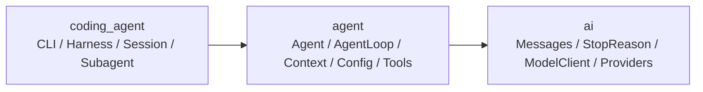

# Pi 第三章 Agent Loop 对照

这份文档用于把教学版第三章的概念逐项对应到 LSM Harness。目标不是逐字翻译
TypeScript，而是保持相同的职责边界、循环顺序和停止语义，同时保留 Python 项目已有的
上下文压缩、安全策略和同步 Provider 接口。

## 1. 三层架构



| Pi 职责 | LSM Harness | 边界 |
| --- | --- | --- |
| `packages/ai` | `lsm_harness/ai` | Provider 中立类型和模型适配，不依赖 Agent |
| `packages/agent` | `lsm_harness/agent` | 通用循环、有状态 Agent、双队列、工具协议 |
| `packages/coding-agent` | `lsm_harness/coding_agent` | CLI、Session、记忆、RAG、具体工具与持久化的组合层 |

旧的 `app.py`、`models.py`、`runtime.py`、`loop/agent.py` 和 `tools/registry.py`
只保留兼容导入；新代码沿三层目录读取。

## 2. Trace 与 Turn

- **Trace**：一次 `Harness.respond()` 从 `trace.started` 到完成、失败或中断。
- **Turn**：一次模型调用，加上这次响应触发的整批工具执行。
- `TraceResult.iterations` 暂时保留旧字段名，`turn_count` 是新的概念入口。

典型工具往返是一个 Trace、两个 Turn：

```text
Trace
├── Turn 1: model → tool_calls → execute tool batch → turn.completed
└── Turn 2: model sees tool results → stop → turn.completed
```

实现位于 `agent/agent_loop.py::_complete_turn()`，回归测试是
`test_turn_hooks_match_model_call_boundaries`。

## 3. Context + Config 边界

产品层先创建：

```python
context = AgentContext(system_prompt=system, messages=messages, tools=tools)
config = AgentLoopConfig(
    model=model,
    max_iterations=10,
    max_tokens=4096,
    before_tool_call=before_tool_call,
    after_tool_call=after_tool_call,
    tool_execution="parallel",
    get_steering_messages=agent.steering_queue.drain,
    get_follow_up_messages=agent.follow_up_queue.drain,
    prepare_next_turn=agent.prepare_next_turn,
    should_stop_after_turn=agent.should_stop_after_turn,
)
run_agent_loop(context=context, config=config, client=client, emit=emit)
```

`transform_context` 在每次 Provider 调用前生成仅用于该请求的上下文；
`convert_to_llm` 在 AI 边界过滤 Agent 内部消息。二者不会把临时转换结果写回原始消息列表。

与 Pi 一样，工具顶层策略也属于 Config：

- `before_tool_call(context)` 在参数准备、校验和审批后运行，可以返回
  `BeforeToolCallResult(block=True, reason=...)` 阻止执行。
- `after_tool_call(context)` 接收最终工具结果，可以通过 `AfterToolCallResult` 按字段覆盖
  output、details、is_error 和 terminate。
- `tool_execution` 选择 `"sequential"` 或 `"parallel"`。并行模式仍采用一票否决：
  任一工具不允许并行，整批按源顺序串行。

批次的所有 preflight（参数准备、Schema 校验、审批、`before_tool_call`）始终按调用顺序
完成，之后才开始串行或并行执行。这与 Pi 的“顺序准备、按策略执行”边界一致。

## 4. 双层循环

LSM 的主干顺序与第三章一致：

```python
pending_messages = get_steering_messages()

while True:                                      # 外层：followUp
    has_more_tool_calls = True
    while has_more_tool_calls or pending_messages:  # 内层：Turn
        inject(pending_messages)
        message = call_model_once()

        if message.stop_reason in ("error", "aborted"):
            return                              # 硬停止，不查 followUp

        tool_calls = message.tool_calls
        has_more_tool_calls = False
        if tool_calls:
            batch = execute_tool_calls(tool_calls)
            has_more_tool_calls = not batch.terminate

        emit_turn_end()
        prepare_next_turn()
        if should_stop_after_turn():
            return                              # 先停，再查队列
        pending_messages = get_steering_messages()

    pending_messages = get_follow_up_messages()
    if not pending_messages:
        break
```

关键顺序是：

```text
模型调用 → 工具批次 → turn_end
→ prepareNextTurn
→ shouldStopAfterTurn
→ steering
→ 内层自然结束后 followUp
```

## 5. 五种 StopReason

| StopReason | LSM 行为 |
| --- | --- |
| `tool_calls` | 执行完整工具批次；批次中无任何 terminate 时继续下一个 Turn |
| `stop` | 当前内层循环准备自然结束，仍会检查 steering 与 followUp |
| `length` | 拒绝可能截断的工具参数，压缩上下文后有限次恢复；失败则结束 |
| `error` | Trace 失败，硬停止，不检查 followUp |
| `aborted` | Trace 中断，硬停止，不检查 followUp |

Provider 的 `tool_use`、`end_turn`、`max_tokens`、`cancelled` 等值统一由
`ai/types.py::normalize_stop_reason()` 归一化。

## 6. 工具批次 terminate

实现使用：

```python
terminate = any(
    tool_result.terminate for _, _, tool_result in batch_results
)
```

因此批次中**任意一个**工具 `terminate=True`，批次结束后即停止后续 Turn。

> **语义统一说明（深度重构计划 §9.5）**：本节旧版曾写 `all/every` 语义，那是跟随
> 当时 Pi 源码的误记。当前实现与已批准的第五章计划统一为 `any`：任何一个工具
> terminate 即停止。对应测试：`test_tool_batch_stops_when_any_result_terminates`
> 与 `test_tool_batch_stops_when_every_result_terminates`（every 是 any 的特例，
> 两者在现行语义下都通过）。

## 7. steering 与 followUp

| 控制消息 | CLI | 检查时机 | 作用 |
| --- | --- | --- | --- |
| steering | 工作中 `Enter` | Loop 开始前、每个 Turn 完成后 | 当前工具批次完成后紧急插队 |
| followUp | 工作中 `Alt+Enter` | 内层循环自然结束后 | 在同一个 Trace 中追加任务 |

两个 `PendingMessageQueue` 默认都是 `one-at-a-time`，也支持 `all`。注入时使用普通 user
message，并发出 `message.started/completed` 与 `loop.steered/followed_up` 事件。

## 8. prepareNextTurn 与 shouldStopAfterTurn

- `prepare_next_turn(context)` 可替换下一轮的 system、messages、model 或 thinking。
- `should_stop_after_turn(context)` 在完整 Turn 结束后优雅停止。
- 停止检查位于两种队列轮询之前，所以返回 `True` 时不会意外消费排队消息。

对应测试：`test_prepare_next_turn_updates_next_model_request` 和
`test_should_stop_after_turn_skips_queue_polls`。

## 9. 与 Pi 的有意差异

| 差异 | 原因 |
| --- | --- |
| Python 同步 Loop + CLI 后台线程 | 当前 Provider 接口是同步生成器；中断与队列仍是线程安全的 |
| 流式内容通过 delta 事件展示，不把 partial message 原地写入历史 | 避免 Provider 生成器读取期间修改同一消息列表；最终消息仍只追加一次 |
| `length` 先拒绝工具参数并尝试压缩恢复 | 跟随当前 Pi 的截断安全方向，并复用 LSM 已有 Context Compression |
| `Harness` 持有 Session/记忆，通用 `Agent` 只持有运行控制面 | 保持产品状态不反向污染可复用 Agent 层 |

这些差异不改变第三章的核心：一个 Turn 只有一次模型调用；工具或 steering 驱动内层循环；
followUp 驱动外层循环；error/aborted 硬停止。

## 10. 学习核对顺序

1. `ai/types.py`：先看五种 StopReason。
2. `agent/types.py`：看 AgentContext 与 AgentLoopConfig。
3. `agent/runtime.py`：看 ActiveRun 和两个 PendingMessageQueue。
4. `agent/agent_loop.py::run_agent_loop()`：看结构化入口。
5. `agent/agent_loop.py::run_loop()`：按双层 while 顺序跟一次 Trace。
6. `coding_agent/cli.py`：看 Enter / Alt+Enter 如何进入两个队列。
7. `tests/test_loop.py`：用确定性模型逐个验证第三章规则。
8. `tests/test_architecture.py`：验证三层依赖没有倒流。
